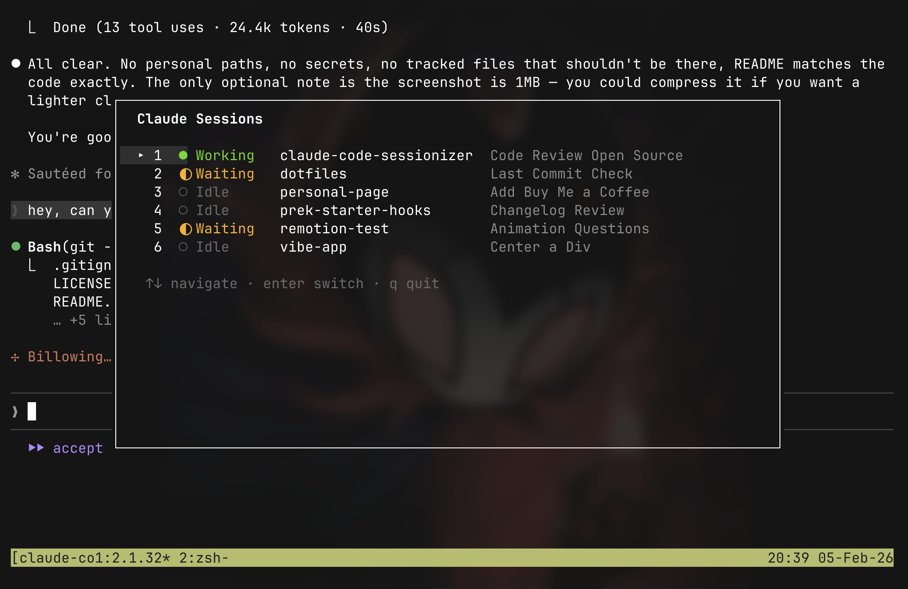

# CSM - Claude Session Manager

A fast TUI for switching between Claude Code sessions in tmux. See all your sessions at a glance with live status detection — know which ones are working, waiting for input, or idle.



## Features

- **Live status detection** — Working (●), Waiting (◐), or Idle (○)
- **Quick switching** — Jump to any session with Enter or number keys
- **Tmux popup support** — Works great as a `display-popup` overlay
- **Auto-refresh** — Session list updates every second

## Installation

### From source

```bash
git clone https://github.com/atbender/claude-session-manager.git
cd claude-session-manager
just install
```

This installs `csm` to `~/.local/bin`. Make sure this directory is in your PATH.

## Usage

Run inside a tmux session:

```bash
csm
```

### Tmux keybinding (recommended)

Add to your `~/.tmux.conf` for quick access:

```tmux
# Popup overlay (tmux 3.2+)
bind C-o display-popup -E -w 80 -h 20 "/path/to/csm"
```

Replace `/path/to/csm` with the actual path (e.g. `~/.local/bin/csm` or the `build/csm` path).

## Keyboard Shortcuts

| Key | Action |
|-----|--------|
| `j/k` or `↑/↓` | Navigate sessions |
| `1-9` | Quick switch to session by number |
| `Enter` | Switch to selected session |
| `q` or `Ctrl+C` | Quit |

## Status Detection

| Symbol | Status | How it's detected |
|--------|--------|-------------------|
| `●` Working | Claude is actively processing | Title has Braille spinner prefix |
| `◐` Waiting | Claude needs user confirmation | Pane content contains "Esc to cancel" |
| `○` Idle | Claude is at the prompt | Default for live sessions |

Sessions are identified by their tmux pane title prefix (`✳` or Braille spinner characters). Exited sessions (where the shell has taken over) are automatically filtered out using `pane_current_command`.

## Requirements

- Go 1.24+
- tmux (3.2+ for `display-popup` support)
- [just](https://github.com/casey/just) task runner (`brew install just`)
- Must be run inside a tmux session

## License

MIT — see [LICENSE](LICENSE)
