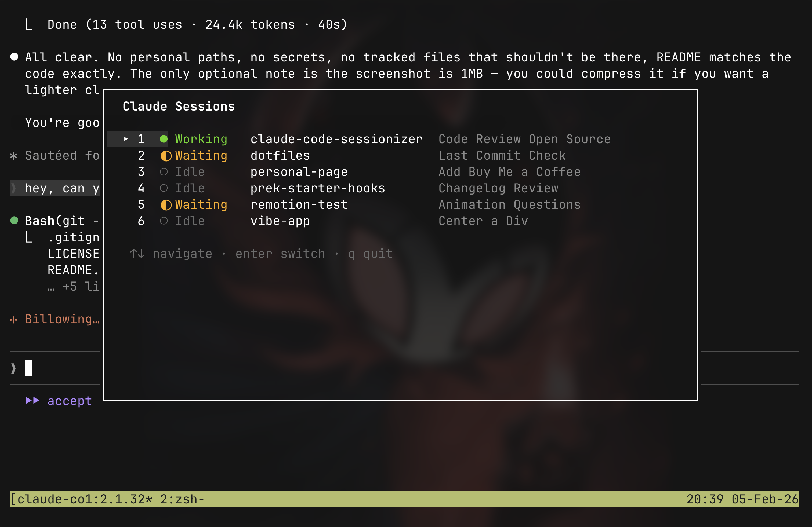

# CSM - Claude Session Manager

a.k.a Cook Something, Man. A fast TUI for managing Claude Code sessions in tmux. See all your live sessions at a glance with status detection, jump between them, resume past projects, or spin up new sessions — without leaving the popup.



## Features

- **Live status detection** — Working (●), Waiting (◐), or Idle (○)
- **Quick switching** — Jump to any session with Enter or number keys
- **Recent projects** — Folders you've used Claude in before (from `~/.claude/projects`), most recent first; press Enter to resume the last conversation there (`claude --continue`)
- **New sessions** — `n` (or `Ctrl+O`) spawns a fresh Claude session in the highlighted row's folder — including a second session for a project that's already open
- **Search** — `/` filters live sessions and the full project history as you type
- **Confirmation gating** — Spawning a session always asks `y/n` first, so a stray keypress never launches anything
- **Responsive layout** — Compact rendering on narrow terminals (phone SSH clients): status icons instead of labels, ellipsized names and paths
- **Tmux popup support** — Works great as a `display-popup` overlay
- **Auto-refresh** — Session list updates every second

## Installation

### From source

```bash
git clone https://github.com/atbender/claude-session-manager.git
cd claude-session-manager
just install
```

This installs `csm` to `~/.local/bin`. Make sure this directory is in your PATH.

## Usage

Run inside a tmux session:

```bash
csm
```

### Tmux keybinding (recommended)

Add to your `~/.tmux.conf` for quick access:

```tmux
# Popup overlay (tmux 3.2+)
bind C-o display-popup -E -w 100% -h 100% "/path/to/csm"
```

Replace `/path/to/csm` with the actual path (e.g. `~/.local/bin/csm` or the `build/csm` path).

### Extra arguments for spawned sessions

Sessions spawned by CSM run plain `claude` (plus `--continue` when resuming). To pass extra flags, set `CSM_CLAUDE_ARGS`. The popup inherits the tmux **server's** environment, not your shell profile, so set it in `~/.tmux.conf`:

```tmux
# e.g. skip permission prompts in spawned sessions
set-environment -g CSM_CLAUDE_ARGS "--dangerously-skip-permissions"
```

## Keyboard Shortcuts

| Key | Action |
|-----|--------|
| `j/k` or `↑/↓` | Navigate |
| `1-9` | Quick-select row by number |
| `Enter` | Switch to session / resume project (asks `y/n` before spawning) |
| `n` or `Ctrl+O` | New fresh session in the highlighted row's folder (asks `y/n`) |
| `/` | Search sessions and full project history (`Ctrl+O` still works while filtering; `Esc` clears) |
| `x` | Kill selected session (asks `y/n` to confirm) |
| `q`, `Esc` or `Ctrl+C` | Quit |

## Status Detection

| Symbol | Status | How it's detected |
|--------|--------|-------------------|
| `●` Working | Claude is actively processing | Title has Braille spinner prefix |
| `◐` Waiting | Claude needs user confirmation | Pane content contains "Esc to cancel" |
| `○` Idle | Claude is at the prompt | Default for live sessions |
| `↻` Resume | Closed project, resumable | Recovered from `~/.claude/projects` transcripts |

Sessions are identified by their tmux pane title prefix (`✳` or Braille spinner characters) plus a live `claude` process in the pane's process tree. Recent projects are recovered from Claude Code's transcript files — the real folder path is read from each transcript's `cwd` field (the encoded directory names are lossy), and folders that no longer exist or are already open live are filtered out.

## Requirements

- Go 1.24+
- tmux (3.2+ for `display-popup` support)
- [just](https://github.com/casey/just) task runner (`brew install just`)
- Must be run inside a tmux session

## License

MIT — see [LICENSE](LICENSE)
